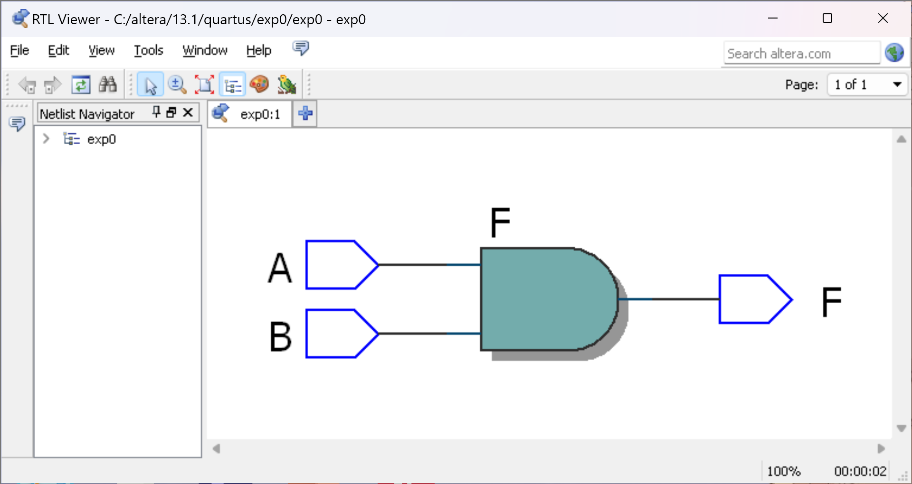
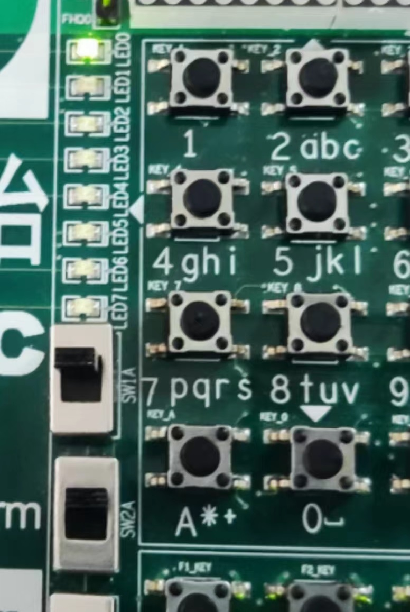

# Verilog HDL 实验-0

> **实验组员：** 史胤隆、林子超

## 实验目的

练习 Quartus II 软件的使用。

## 实验内容

完成与门电路的程序设计，生成电路图，进行实验箱验证。

## 实验步骤

1. 打开 Quartus II 13.1；

1. 选择 `File` -> `New Project Wizard...` 创建一个新的工程；

1. `Directory, Name, Top-Level Entity` 页面，在 `altera\13.1\quartus` 目录下新建一个自命名文件夹并将其设为工程目录并赋予相同的项目名，此处命名为 `exp0`；

1. `Family & Device Settings` 页面，选择 `Cyclone III` 为 `Device Family`，`EP3C25Q240C8` 为 `Avialable Devices`；

1. 完成工程新建；

1. 选择 `File` -> `New` -> `Verilog HDL File` 创建一个新的 Verilog HDL 文件；

1. 编写程序并保存，文件名应与模块名一致，此处命名为 `exp0.v`；

1. 执行逻辑编译，无误后，执行全编译；

1. 选择 `Tools` -> `Netlist Viewers` -> `RTL Viewer` 查看电路图；

1. 核对电路图无误，关闭 RTL Viewer；

1. 选择 `Assignments` -> `Pin Planner`，打开引脚分配窗口；

1. 在 `All Pins` 选项卡的 `Location` 列中对各个端口分配引脚，可选的芯片引脚如下：

   | 性质     | 芯片引脚                                                               |
   | -------- | ---------------------------------------------------------------------- |
   | 输出端口 | `PIN_9` `PIN_13` `PIN_18` `PIN_21` `PIN_22` `PIN_37` `PIN_38` `PIN_39` |
   | 输入端口 | `PIN_70` `PIN_72` `PIN_76` `PIN_80`                                    |

   此处为 `F` 分配 `PIN_9` 引脚，为 `A` 分配 `PIN_70` 引脚，为`B` 分配 `PIN_72` 引脚；

1. 关闭引脚分配窗口，重新进行全编译；

1. 连接实验箱，将实验箱上的 MODUL_SEL 拨码开关组合的 2 - 6 拨下为 ON，1、7、8 拨下为 OFF，使数码管显示为 `C1`；

1. 点击程序上传按钮，打开上传窗口；

1. 在 `Hardware Setup...` 页面卡中选择对应的 USB 下载器，在 `Add File...` 页面卡中选择 `output_files\` 目录下的 `exp0.sof` 文件，点击 `Start` 按钮上传程序；

1. 上传成功后，操作实验箱进行验证。

<div STYLE="page-break-after: always;"></div>

## 源程序

- exp0.v

  ```verilog
  module exp0 (
      output F,
      input A, B
  );
      assign F = A & B;
  endmodule

  ```

## 实验结论

- 电路图

  

- 实验箱验证

  

## 实验结果分析

1. 代码无误，电路图无误，实验结果正确。
1. 操作实验箱，当 `PIN_70` 和 `PIN_72` 对应的两个输入开关均为高电平时，`PIN_9` 对应的发光二极管点亮，否则该发光二极管熄灭。
