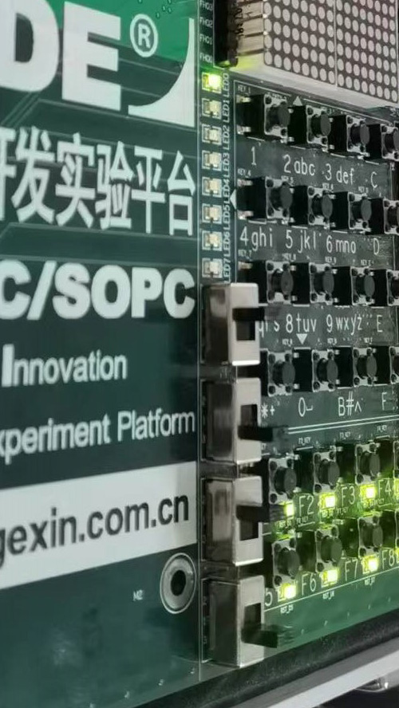
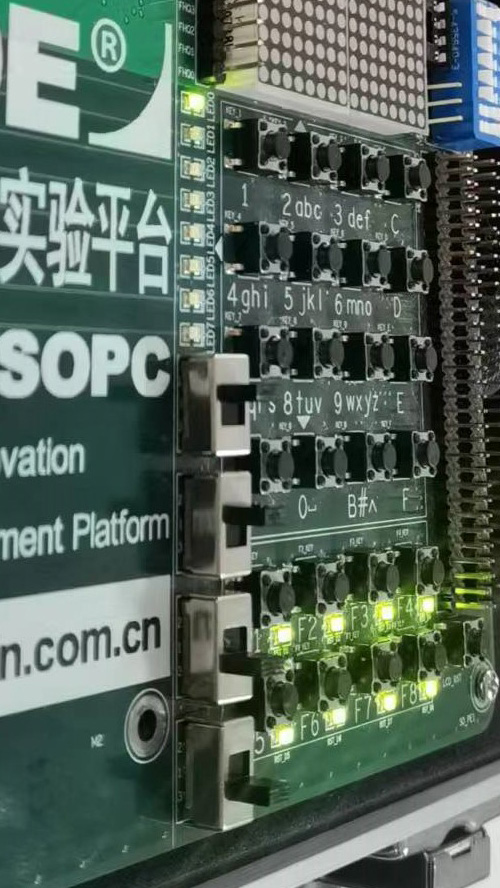
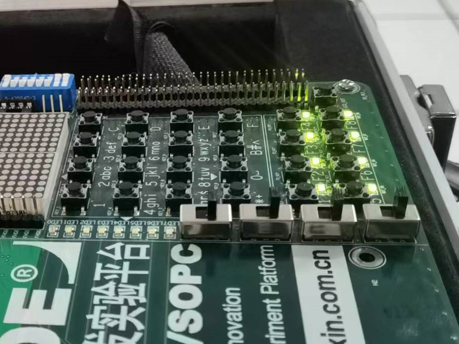
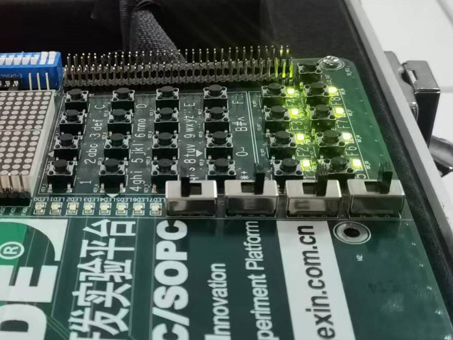
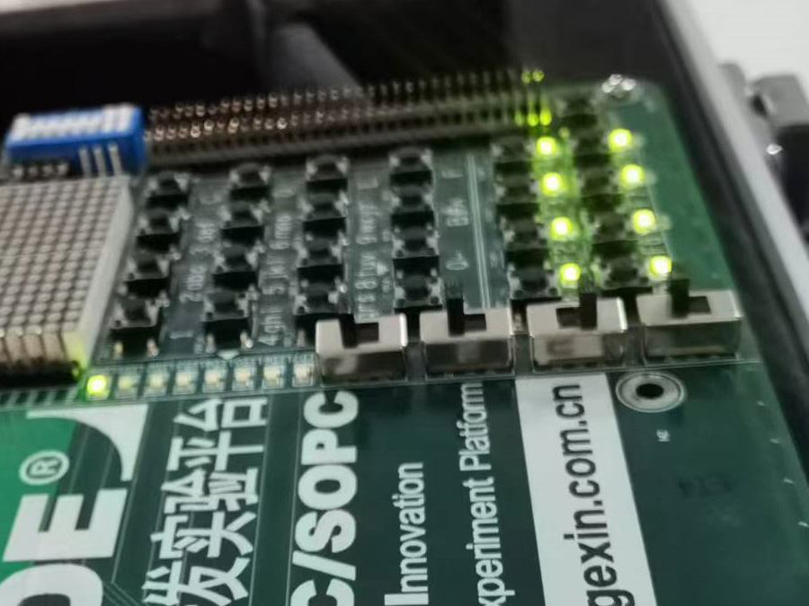
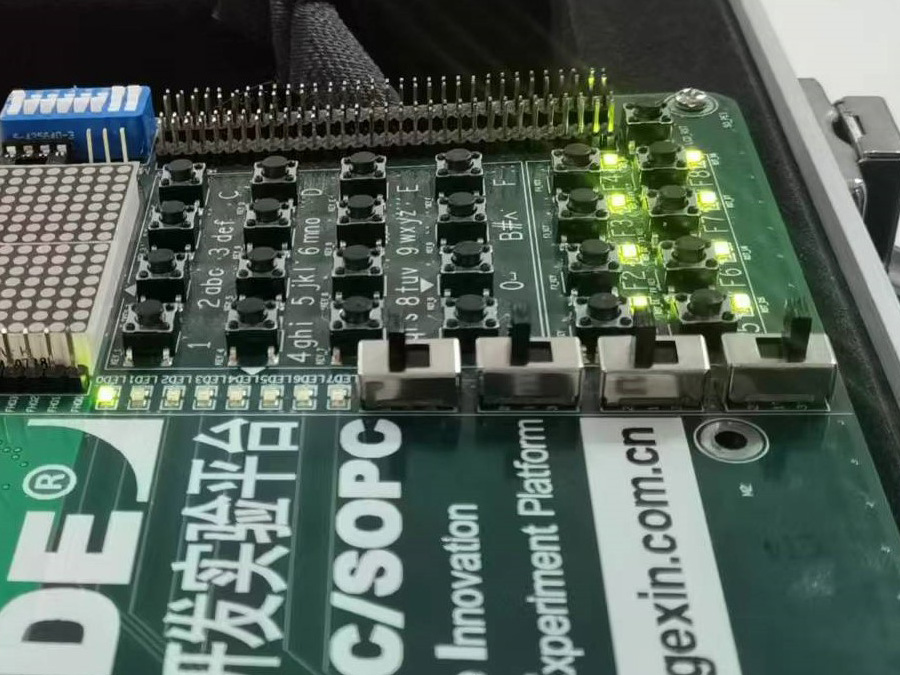

# Verilog HDL 实验-1

> **实验组员：** 史胤隆、林子超

## 实验目的

练习 Quartus II 软件的使用。

## 实验内容

完成二选一电路和三人表决器电路的程序设计，进行实验箱验证。

## 实验步骤

1. 打开 Quartus II 13.1，新建工程 `exp1`，

1. 新建 Verilog HDL 文件，编写二选一电路程序并保存，命名为 `exp1.v`；

1. 执行逻辑编译，无误后，执行全编译；

1. 进入引脚分配窗口，如下定义引脚：

   | 端口名 | 芯片引脚 |
   | ------ | -------- |
   | F      | `PIN_9`  |
   | A      | `PIN_70` |
   | B      | `PIN_72` |
   | cel    | `PIN_76` |

1. 关闭引脚分配窗口，重新进行全编译并上传实验箱；

1. 操作实验箱进行验证；

1. 再次打开 `exp1.v`，编写三人表决器电路程序并保存，编译；

1. 如下定义引脚：

   | 端口名 | 芯片引脚 |
   | ------ | -------- |
   | F      | `PIN_9`  |
   | A      | `PIN_70` |
   | B      | `PIN_72` |
   | C      | `PIN_76` |

1. 重新进行全编译、上传实验箱，操作实验箱进行验证。

<div STYLE="page-break-after: always;"></div>

## 源程序

- 二选一电路

  ```verilog
  module exp1 (
      output F,
      input A, B, cel
  );
      assign F = cel ? A : B;
  endmodule

  ```

- 三人表决器电路

  ```verilog
  module exp1 (
      output F,
      input A, B, C
  );
      assign F = A & B | A & C | B & C;
  endmodule

  ```

## 实验结论

- 二选一电路

   

<div STYLE="page-break-after: always;"></div>

- 三人表决器电路

   

   

## 实验结果分析

1. 代码无误，实验结果正确。
1. 上传二选一电路程序，操作实验箱，当 `PIN_76` 对应的输入开关均高电平时，`PIN_9` 对应的发光二极管点亮点亮状态与 `PIN_70` 对应输入开关电平一致，否则与 `PIN_72` 对应输入开关电平一致。
1. 上传三人表决器电路程序，操作实验箱，当 `PIN_70`、`PIN_72`、`PIN_76` 对应的输入开关至少有两个高电平时，`PIN_9` 对应的发光二极管点亮，否则该发光二极管熄灭。
