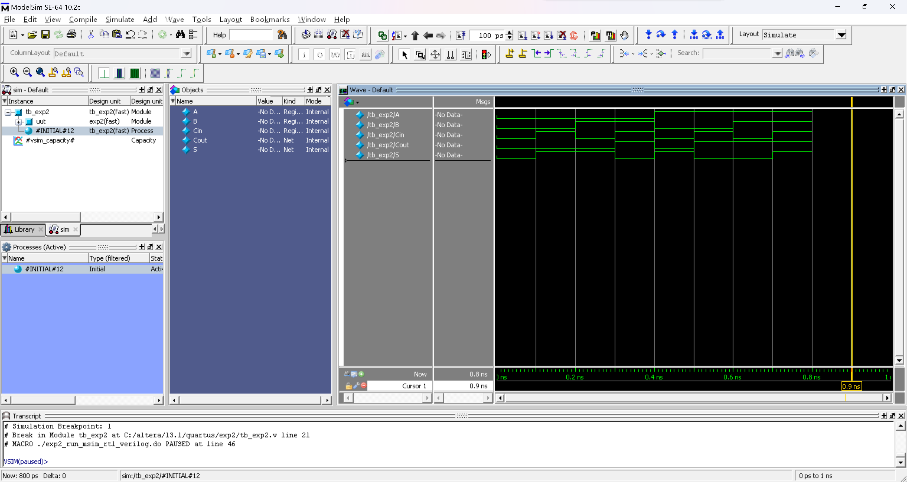
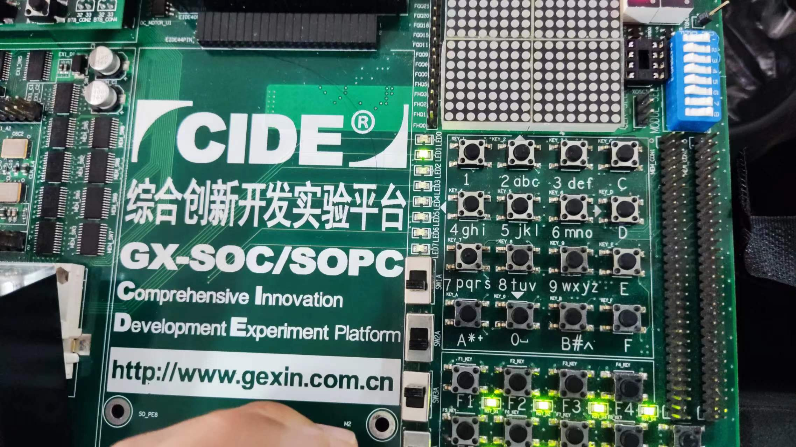
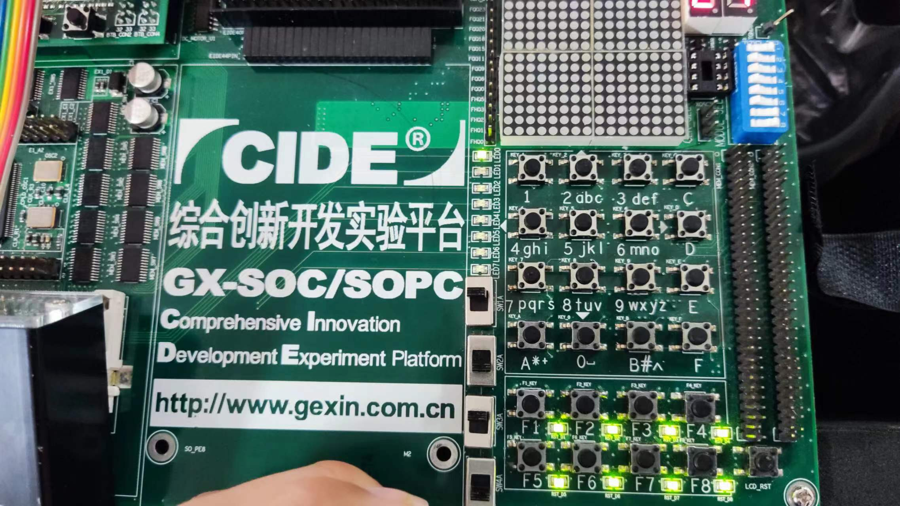
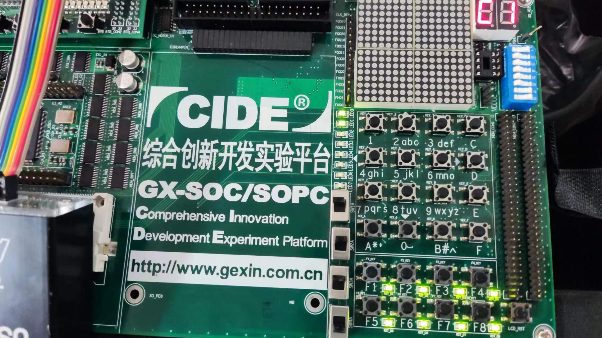

# Verilog HDL 实验-2

> **实验组员：** 史胤隆、林子超

## 实验目的

- 练习 Quartus II 和 Modelsim 软件的使用；
- 针对行为语句中的过程赋值、条件语句进行练习。

## 实验内容

- 完成全加器电路，进行综合（RTL）和仿真（功能仿真），查看综合和仿真结果并对仿真波形进行分析；
- 进行实验箱验证。

## 实验步骤

1. 打开 Quartus II 13.1，新建工程 `exp2`，新建 Verilog HDL 文件，编写全加器电路程序并保存为 `exp2.v`；

1. 执行逻辑编译，无误后，执行全编译；

1. 再次新建一个 Verilog HDL 文件作为仿真 testbench，编写仿真程序并保存为 `tb_exp2.v`；

1. 选择 `Assignments` -> `Settings...`，打开设置窗口；

1. 在 `EDA Tools Settings` -> `Simulation` 中，选择仿真工具 (`ModelSim-Altera` 或 `ModelSim`)；

1. 在下方 `NativeLink Settings` 中，选中 `Compile test bench`，并打开 `Test Benches...`；

1. 在打开的窗口中点击 `New` 新建一个仿真；

1. 在 `Test bench name` 和 `Top level module in test bench` 中一致输入 testbench 模块名，在下方 `File name` 右侧的 `...` 中选择 testbench 文件并点击 `add` 添加，这里我们输入 `tb_exp2` 以及选择 `tb_exp2.v`；

1. 连续点击 `OK` 直到关闭设置窗口；

1. 再次执行逻辑编译，无误后，执行全编译；

1. 点击功能仿真按钮，查看仿真结果，分析波形；

1. 完成波形仿真后，关闭 ModelSim，进入引脚分配窗口，如下定义引脚：

   | Cout    | S        | A        | B        | Cin      |
   | :------ | -------- | -------- | -------- | -------- |
   | `PIN_9` | `PIN_13` | `PIN_70` | `PIN_72` | `PIN_76` |

1. 关闭引脚分配窗口，重新进行全编译并上传实验箱，操作实验箱进行验证。

<div STYLE="page-break-after: always;"></div>

## 源程序

- exp2.v

  ```verilog
  module exp2 (
      output reg Cout, S,
      input A, B, Cin
  );
      always @(A, B, Cin)
          {Cout, S} = A + B + Cin;
  endmodule

  ```

- tb_exp2.v

  ```verilog
  `timescale 10ps/1ps
  module tb_exp2 ();
      reg A, B, Cin;
      wire Cout, S;
      exp2 uut (
          .A(A),
          .B(B),
          .Cin(Cin),
          .Cout(Cout),
          .S(S)
      );
      initial begin
                  A = 0; B = 0; Cin = 0;
          # 10    A = 0; B = 0; Cin = 1;
          # 10    A = 0; B = 1; Cin = 0;
          # 10    A = 0; B = 1; Cin = 1;
          # 10    A = 1; B = 0; Cin = 0;
          # 10    A = 1; B = 0; Cin = 1;
          # 10    A = 1; B = 1; Cin = 0;
          # 10    A = 1; B = 1; Cin = 1;
          # 10    $finish;
      end
  endmodule
  
  ```

<div STYLE="page-break-after: always;"></div>

## 实验结论

- 仿真波形

  

- 实验箱验证

  

  

  

<div STYLE="page-break-after: always;"></div>

## 实验结果分析

1. 代码无误，编译正确，实验结果正确。
1. 观察仿真波形可得以下真值表：

   |  A  |  B  | Cin | Cout |  S  |
   | :-: | :-: | :-: | :--: | :-: |
   |  0  |  0  |  0  |  0   |  0  |
   |  0  |  0  |  1  |  0   |  1  |
   |  0  |  1  |  0  |  0   |  1  |
   |  0  |  1  |  1  |  1   |  0  |
   |  1  |  0  |  0  |  0   |  1  |
   |  1  |  0  |  1  |  1   |  0  |
   |  1  |  1  |  0  |  1   |  0  |
   |  1  |  1  |  1  |  1   |  1  |

   与全加器期望的真值表相同，程序功能与全加器期望的功能一致。

1. 上传程序并操作实验箱，验证结果同上，实验完毕。
