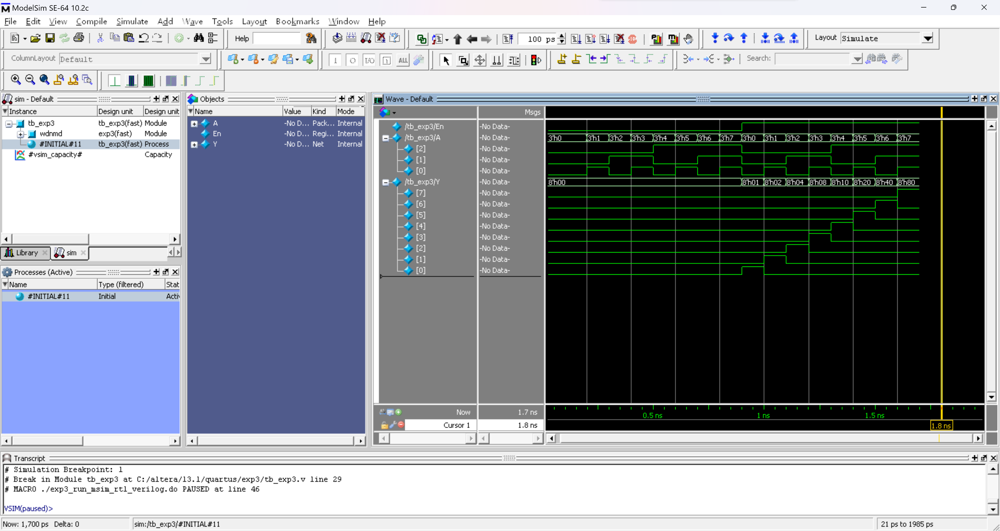
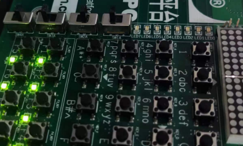
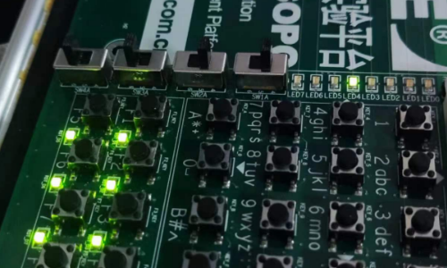

# Verilog HDL 实验-3

> **实验组员：** 史胤隆、林子超

## 实验目的

- 针对行为语句中的过程赋值、条件语句进行练习。

## 实验内容

- 完成 3-8 译码器电路电路，进行综合（RTL）和仿真（功能仿真），查看综合和仿真结果并对仿真波形进行分析；
- 进行实验箱验证。

## 实验步骤

1. 打开 Quartus II 13.1，新建工程 `exp3`，编写 3-8 译码器电路程序并保存为 `exp3.v`；

1. 执行逻辑编译，无误后，执行全编译；

1. 编写仿真程序并保存为 `tb_exp2.v`；

1. 设置仿真工具，再次执行逻辑编译，无误后，执行全编译；

1. 点击功能仿真按钮，查看仿真结果，分析波形；

1. 完成波形仿真后，关闭 ModelSim，进入引脚分配窗口，如下定义引脚：

   | **Y[0]** | **Y[1]** | **Y[2]** | **Y[3]** | **Y[4]** | **Y[5]** | **Y[6]** | **Y[7]** |
   | :------- | -------- | -------- | -------- | -------- | -------- | -------- | -------- |
   | `PIN_9`  | `PIN_13` | `PIN_18` | `PIN_21` | `PIN_22` | `PIN_37` | `PIN_38` | `PIN_39` |
   | **En**   | **A[0]** | **A[1]** | **A[2]** |          |          |          |          |
   | `PIN_70` | `PIN_72` | `PIN_76` | `PIN_80` |          |          |          |          |

1. 关闭引脚分配窗口，重新进行全编译并上传实验箱，操作实验箱进行验证。

<div STYLE="page-break-after: always;"></div>

## 源程序

- exp3.v

  ```verilog
  module exp3(
      input En, input [2:0]A,
      output reg[7:0]Y
  );
      always @A begin
          if (En==0) Y=8'b00000000;
          else case (A)
              3'd0:Y=8'b00000001;
              3'd1:Y=8'b00000010;
              3'd2:Y=8'b00000100;
              3'd3:Y=8'b00001000;
              3'd4:Y=8'b00010000;
              3'd5:Y=8'b00100000;
              3'd6:Y=8'b01000000;
              3'd7:Y=8'b10000000;
              default:Y=8'b00000000;
          endcase
      end
  endmodule

  ```

- tb_exp3.v

  ```verilog
  `timescale 10ps/1ps
  module tb_exp3();
      reg [2:0]A; reg En;
      wire [7:0]Y;
      exp3 uut(.En(En), .A(A), .Y(Y));
      initial begin
                  En = 0;  A = 3'b000;
          #10     En = 0;  A = 3'b001;
          #10     En = 0;  A = 3'b010;
          #10     En = 0;  A = 3'b011;
          #10     En = 0;  A = 3'b100;
          #10     En = 0;  A = 3'b101;
          #10     En = 0;  A = 3'b110;
          #10     En = 0;  A = 3'b111;
          #10     En = 1;  A = 3'b000;
          #10     En = 1;  A = 3'b001;
          #10     En = 1;  A = 3'b010;
          #10     En = 1;  A = 3'b011;
          #10     En = 1;  A = 3'b100;
          #10     En = 1;  A = 3'b101;
          #10     En = 1;  A = 3'b110;
          #10     En = 1;  A = 3'b111;
          #10     $finish;
      end
  endmodule
  
  ```

<div STYLE="page-break-after: always;"></div>

## 实验结论

- 仿真波形

  

- 实验箱验证

  

  

<div STYLE="page-break-after: always;"></div>

## 实验结果分析

1. 代码无误，编译正确，实验结果正确。
2. 观察仿真波形可得以下真值表：

   | En  | A[2] | A[1] | A[0] | Y[7] | Y[6] | Y[5] | Y[4] | Y[3] | Y[2] | Y[1] | Y[0] |
   | :-: | :--: | :--: | :--: | :--: | :--: | :--: | :--: | :--: | :--: | :--: | :--: |
   |  0  |  d   |  d   |  d   |  0   |  0   |  0   |  0   |  0   |  0   |  0   |  0   |
   |  1  |  0   |  0   |  0   |  0   |  0   |  0   |  0   |  0   |  0   |  0   |  1   |
   |  1  |  0   |  0   |  1   |  0   |  0   |  0   |  0   |  0   |  0   |  1   |  0   |
   |  1  |  0   |  1   |  0   |  0   |  0   |  0   |  0   |  0   |  1   |  0   |  0   |
   |  1  |  0   |  1   |  1   |  0   |  0   |  0   |  0   |  1   |  0   |  0   |  0   |
   |  1  |  1   |  0   |  0   |  0   |  0   |  0   |  1   |  0   |  0   |  0   |  0   |
   |  1  |  1   |  0   |  1   |  0   |  0   |  1   |  0   |  0   |  0   |  0   |  0   |
   |  1  |  1   |  1   |  0   |  0   |  1   |  0   |  0   |  0   |  0   |  0   |  0   |
   |  1  |  1   |  1   |  1   |  1   |  0   |  0   |  0   |  0   |  0   |  0   |  0   |

   与 3-8 译码器期望的真值表相同，程序功能与 3-8 译码器期望的功能一致。

3. 上传程序并操作实验箱，验证结果同上，实验完毕。
