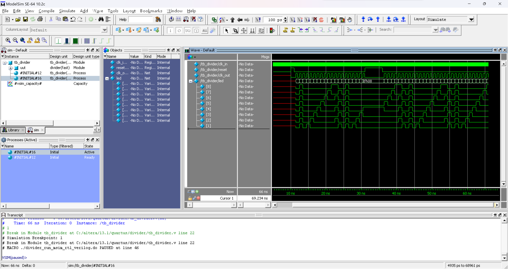
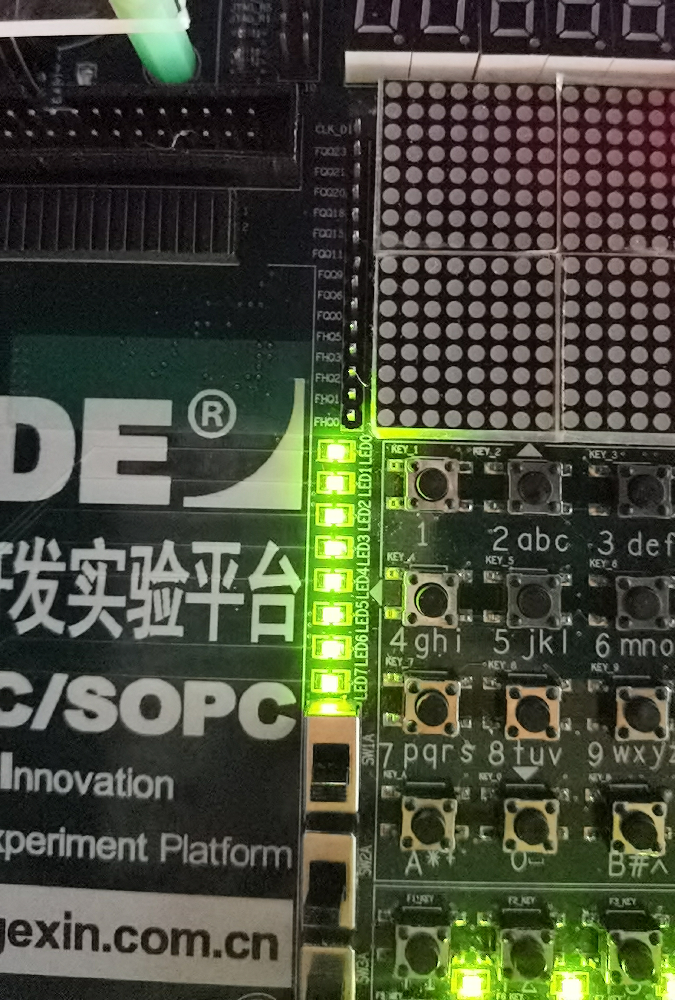
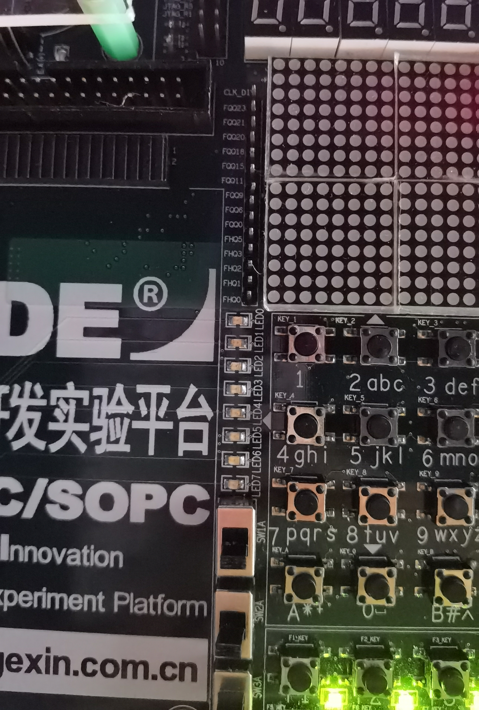
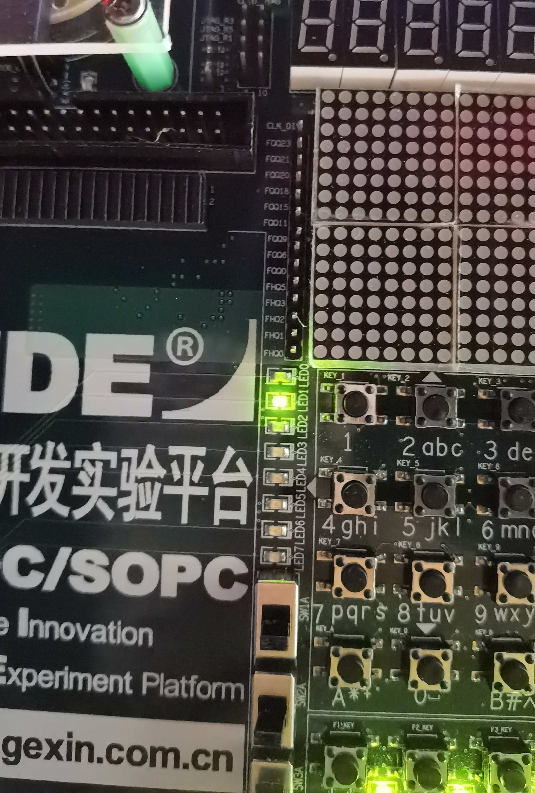
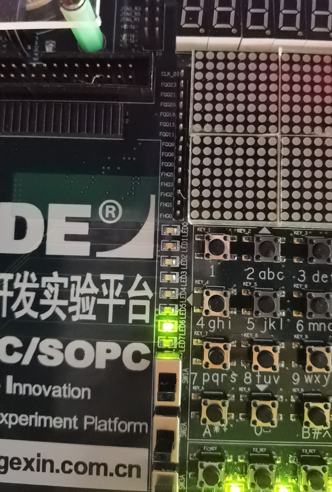
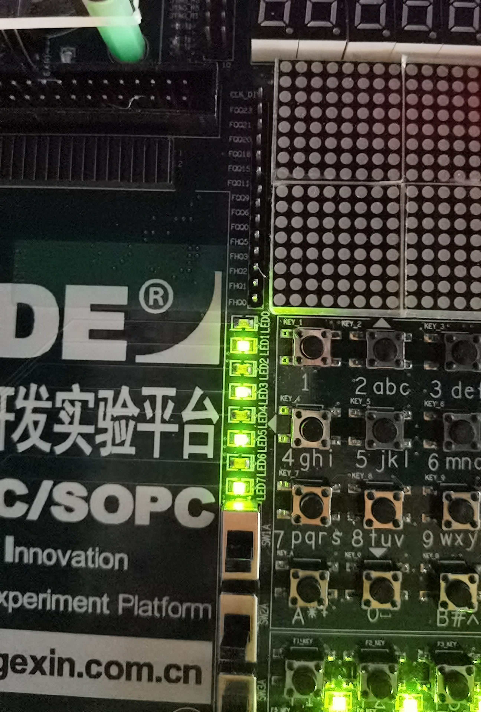

# FPGA 技术及应用 实验-2

> **实验组员：** 史胤隆、彭淳毅

## 实验目的

熟悉状态机编程.

## 实验知识点

- **有限状态机**: 有限状态机是一种数字逻辑设计方法, 它的基本思想是将系统的行为抽象为有限个状态, 状态机的输出信号与当前状态和输入信号有关.

## 实验内容

1. 用状态机编写一个 8 路彩灯控制程序, 要求彩灯有以下 3 种演示花型：

   8 路彩灯同时亮灭; 从左至右逐个亮 (每次只有 1 路亮); 8 路彩灯每次 4 路灯亮, 4 路灯灭, 且亮灭相间, 交替亮灭.

   在演示过程中, 只有当一种花型演示完毕才能转向其他演示花型.

1. 将试验箱的 50MHz 频率信号分频为 1Hz 信号, 驱动上述实验的彩灯程序.

## 实验过程

1. 打开 Quartus II 13.1, 新建工程 `divider`, 编写分频器流水灯电路程序, 其中的分频器频率为：

   ```verilog
   parameter count = 10;
   ```

   保存, 设置文件名为 `divider.v`;

1. 执行逻辑编译, 无误后, 执行全编译;

1. 编写仿真程序并保存为 `tb_divider.v`;

1. 设置仿真工具, 再次执行逻辑编译, 无误后, 执行全编译;

1. 点击功能仿真按钮, 查看仿真结果, 分析波形;

1. 完成波形仿真后, 关闭 ModelSim, 将分频器频率修改为：

   ```verilog
   parameter count = 10000000;
   ```

   重新保存, 并执行全编译;

1. 进入引脚分配窗口, 如下定义引脚：

   | **led[0]** | **led[1]** | **led[2]**  | **led[3]** | **led[4]** | **led[5]** | **led[6]** | **led[7]** |
   | :--------- | ---------- | ----------- | ---------- | ---------- | ---------- | ---------- | ---------- |
   | `PIN_9`    | `PIN_13`   | `PIN_18`    | `PIN_21`   | `PIN_22`   | `PIN_37`   | `PIN_38`   | `PIN_39`   |
   | **clk_in** | **reset**  | **clk_out** |            |            |            |            |            |
   | `PIN_150`  | `PIN_70`   | 不定义      |            |            |            |            |            |

1. 关闭引脚分配窗口, 重新进行全编译并上传实验箱, 操作实验箱进行验证.

## 实验代码

- **divider.v**

  ```Verilog
  module divider(
      input clk_in, reset,
      output reg clk_out,
      output reg[8:1] led
  );
      reg[31:0] cnt;
      parameter count = 10;
      always @ (posedge clk_in or posedge reset) begin
          if(reset) begin
              cnt <= 0;
              clk_out <= 0;
          end
          else if(cnt == count/2-1) begin
              clk_out = !clk_out;
              cnt <= 0;
          end
          else begin
              cnt <= cnt+1;
              clk_out <= clk_out;
          end
      end
      reg[4:1] state;
      always @ (posedge clk_out) begin
          state = state + 4'b0001;
          case(state)
              4'b0001: led <= 8'b11111111;
              4'b0010: led <= 8'b00000000;
              4'b0011: led <= 8'b00000001;
              4'b0100: led <= 8'b00000010;
              4'b0101: led <= 8'b00000100;
              4'b0110: led <= 8'b00001000;
              4'b0111: led <= 8'b00010000;
              4'b1000: led <= 8'b00100000;
              4'b1001: led <= 8'b01000000;
              4'b1010: led <= 8'b10000000;
              4'b1011: led <= 8'b10101010;
              4'b1100: led <= 8'b01010101;
              default: begin
                  state <= 4'b0000;
                  led <= 8'b00000000;
              end
          endcase
      end
  endmodule

  ```

  <div STYLE="page-break-after: always;"></div>

- **tb_divider.v**

  ```Verilog
  `timescale 10ps/1ps
  module tb_divider();
      reg clk_in, reset;
      wire clk_out;
      wire [8:1] led;
      divider uut (
          .clk_in     (clk_in),
          .reset      (reset),
          .clk_out    (clk_out),
          .led        (led)
      );
      initial begin
          clk_in = 0;
          forever #5 clk_in = ~clk_in;
      end
      initial begin
                  reset = 0;
          #1000   reset = 1;
          #100    reset = 0;
          #2000   reset = 1;
          #500    reset = 0;
          #3000   $finish;
      end
  endmodule
  
  ```


## 仿真波形图及实验箱验证

- 仿真波形

  

  <div STYLE="page-break-after: always;"></div>

- 实验箱验证

    

    


## 实验结果及总结

1. 代码无误, 编译正确.

1. 观察仿真波形, 可见：

   - `clk_in` 波形快速振荡;
   - 当 `reset` 输入完成一次高低电平切换后, `clk_out` 波形开始慢速振荡, `led` 输出开始按照预定模式运行;
   - 当 `reset` 输入为高电平时, `clk_out` 波形和 `led` 输出暂停运行;
   - 当 `reset` 输入为低电平时, `clk_out` 波形和 `led` 输出恢复运行.

   综上, 程序设计结果正确;

1. 上传程序并操作实验箱, 观察到运行结果同上, 实验完毕.
