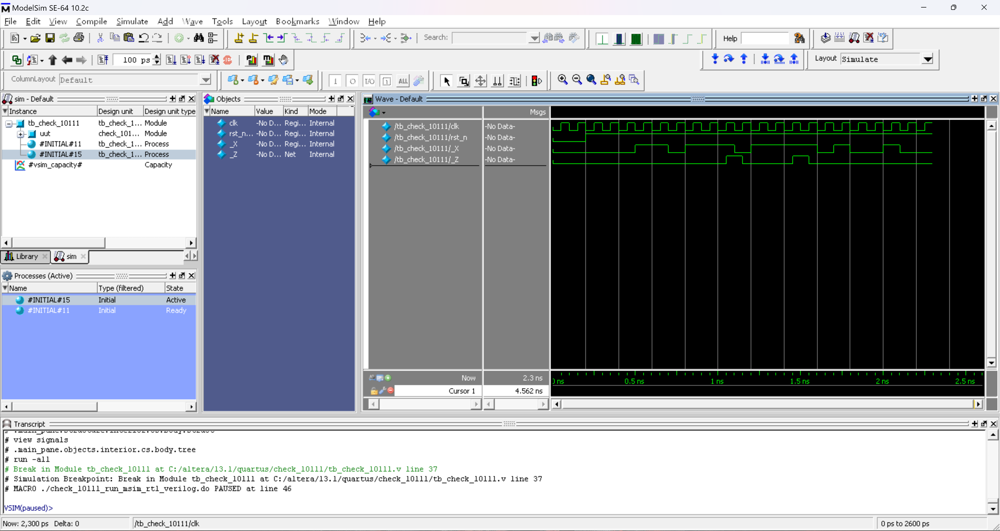

# FPGA 技术及应用 实验-3

> **实验组员：** 史胤隆、彭淳毅

## 实验目的

加强练习有限状态机程序设计.

## 实验内容

设计设计一个二进制序列检测器, 当检测到 `10111` 序列时, 就输出 `1` (一个时钟周期的脉冲), 其他情况下输出 `0`.

进行功能仿真, 将 Verilog 代码和仿真波形图整理入实验报告.

## 实验代码

- **check_10111.v**

  ```Verilog
  module check_10111 (
      input _X, clk, rst_n,
      output reg _Z
  );
      reg [2:0] cur_state;
      reg [2:0] next_state;
      parameter s0 = 3'b000;  // 0
      parameter s1 = 3'b001;  // 1
      parameter s2 = 3'b011;  // 10
      parameter s3 = 3'b010;  // 101
      parameter s4 = 3'b110;  // 1011
      parameter s5 = 3'b111;  // 10111
      always @ (posedge clk or negedge rst_n)
          if (!rst_n) cur_state <= s0;
          else cur_state <= next_state;
      always @ (_X or cur_state) case (cur_state)
          s0: next_state <= _X ? s1 : s0;
          s1: next_state <= _X ? s1 : s2;
          s2: next_state <= _X ? s3 : s0;
          s3: next_state <= _X ? s4 : s2;
          s4: next_state <= _X ? s5 : s2;
          s5: next_state <= _X ? s1 : s2;
          default: next_state <= s0;
      endcase
      always @ (cur_state) _Z <= (cur_state == s5);
  endmodule

  ```

- **tb_check_10111.v**

  ```Verilog
  `timescale 10ps/1ps
  module tb_check_10111 ();
      reg clk, rst_n, _X;
      wire _Z;
      check_10111 uut (
          .clk(clk),
          .rst_n(rst_n),
          ._X(_X),
          ._Z(_Z)
      );
      initial begin
          clk = 0;
          forever #5 clk = ~clk;
      end
      initial begin
              rst_n = 0;
              _X = 0;
          #20 rst_n = 1;
          #20 _X = 0;
          #10 _X = 1;
          #10 _X = 1;
          #10 _X = 0;
          #10 _X = 1;
          #10 _X = 1;
          #10 _X = 1; // 10111
          #10 _X = 0;
          #10 _X = 1;
          #10 _X = 1;
          #10 _X = 1; // 10111
          #10 _X = 1;
          #10 _X = 0;
          #10 _X = 1;
          #10 _X = 0;
          #10 _X = 0;
          #10 _X = 1;
          #10 _X = 0;
          #20 $stop;
      end
  endmodule

  ```

## 仿真波形图



## 实验结果及总结
