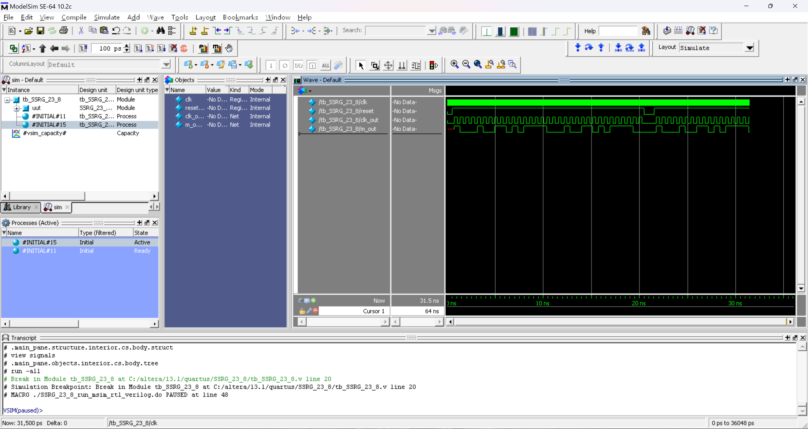

# FPGA 技术及应用 实验-4

> **实验组员：** 史胤隆、彭淳毅

## 实验目的

深入理解层次化设计, 强化实验设备使用.

## 实验内容

设计 n 为 4, 反馈系数 Ci 为 (23)~8~ 的 m 序列发生器, 设计测试程序, 进行功能仿真.

要求具备异步复位信号 `reset` (低电平有效), 移位寄存器复位状态为最高位为 `1`, 其余各位均为 `0`.

设计分频程序将 6Hz 时钟信号分频为 1Hz 时钟信号.


## 实验代码

### 顶层模块

- **SSRG_23_8.v**

  ```Verilog
  module SSRG_23_8 (
      input clk, reset,
      output clk_out, m_out
  );
      M_23_8 M (
          .m_out(m_out),
          .clk(clk_out),
          .reset(reset)
      );
      divider_6 div (
          .clk_out(clk_out),
          .clk_in(clk),
          .reset(reset)
      );
  endmodule
  
  ```

<div STYLE="page-break-after: always;"></div>

### 子模块

- **M_23_8.v**

  ```Verilog
  module M_23_8 (
      input clk, reset,
      output reg m_out
  );
      reg[3:0] shift_reg;
      always @ (posedge clk or negedge reset)
          if (!reset) shift_reg = 4'b1000;
          else begin
              shift_reg[0] <= shift_reg[3] ^ shift_reg[2];
              {m_out, shift_reg[3:1]} <= shift_reg[3:0];
          end
  endmodule

  ```

- **divider_6.v**

  ```Verilog
  module divider_6 (
      input clk_in, reset,
      output reg clk_out
  );
      reg[1:0] cnt;
      always @ (posedge clk_in or negedge reset)
          if (!reset) begin
              cnt <= 2'b00;
              clk_out <= 1'b0;
          end
          else if (cnt == 2'b10) begin
              cnt <= 2'b00;
              clk_out <= !clk_out;
          end
          else cnt <= cnt + 2'b01;
  endmodule
  
  ```


### Testbench

- **tb_SSRG_23_8.v**

  ```Verilog
  `timescale 10ps/1ps
  module tb_SSRG_23_8 ();
      reg clk, reset;
      wire clk_out, m_out;
      SSRG_23_8 uut (
          .clk(clk),
          .reset(reset),
          .clk_out(clk_out),
          .m_out(m_out)
      );
      initial begin
          clk = 0;
          forever #5 clk = !clk;
      end
      initial begin
                  reset = 0;
          #50     reset = 1;
          #2000   reset = 0;
          #100    reset = 1;
          #1000   $stop;
      end
  endmodule
  
  ```


## 仿真波形图




## 实验结果及总结

1. 代码无误, 编译正确;

1. 各个实验波形符合预期, 实验结果正确.
